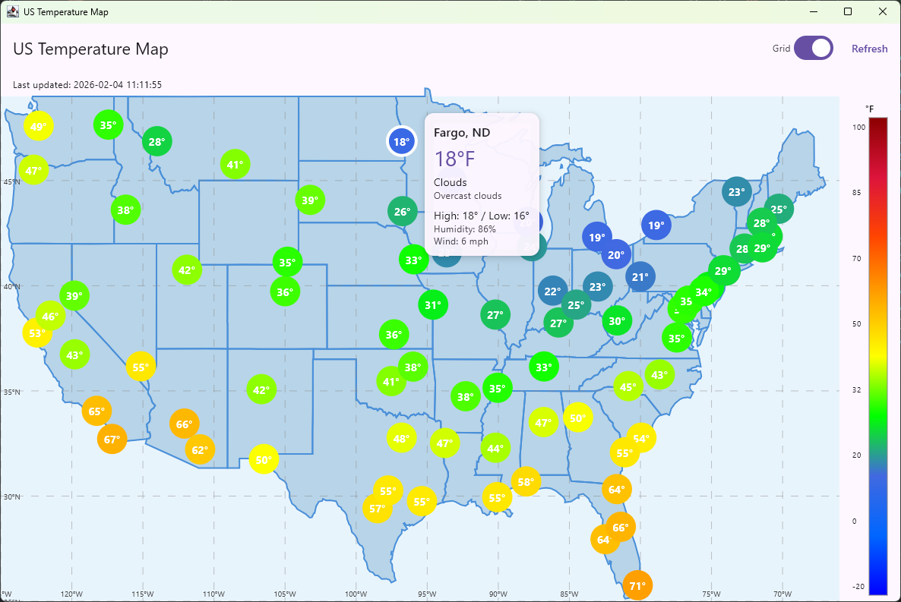

# US Temperature Map

A Kotlin Multiplatform application that displays real-time temperatures for major US cities on an interactive map with state boundaries.



## Features

- **Instant temperature loading** - pre-cached data from GitHub Actions loads all 80 cities immediately
- **Real-time refresh** - fetch live data from OpenWeatherMap API on demand
- **Interactive city markers** - hover to preview, click/tap to pin detailed weather information
- **City tooltips** showing temperature, weather conditions, high/low, humidity, and wind speed with direction
- **Precise state boundaries** rendered from GeoJSON data (48 continental states)
- **Color-coded temperatures** with white text and colored circles (blue for cold, red for hot)
- **5° x 5° grid overlay** with latitude/longitude labels (toggleable)
- **Cross-platform** - runs on Desktop (JVM) and Web (Wasm/JS)

## How It Works

Temperature data is pre-fetched by a GitHub Actions cron job every 3 hours and stored as a static JSON file (`dist/temperatures.json`). When the app loads, it reads this cached data instantly — no API key needed for the web version.

| Platform | Startup | Refresh Button |
|----------|---------|----------------|
| **Web (Vercel)** | Loads cached `temperatures.json` from CDN | Re-fetches cached file |
| **Desktop (JVM)** | Loads cached `dist/temperatures.json` from disk | Live API fetch, saves back to cache |
| **Fallback** | If cache unavailable, prompts for API key | Progressive API loading |

## Requirements

- JDK 17 or higher
- OpenWeatherMap API key (only needed for JVM refresh or if cache is unavailable)

## Getting Started

### Run Desktop Application

```shell
# Windows
.\gradlew.bat :composeApp:run

# macOS/Linux
./gradlew :composeApp:run
```

The desktop app loads cached temperatures on startup. Click **Refresh** to fetch live data (requires `OPENWEATHERMAP_API_KEY` environment variable).

### Run Web Application

```shell
# Wasm target (faster, modern browsers)
.\gradlew.bat :composeApp:wasmJsBrowserDevelopmentRun

# JS target (supports older browsers)
.\gradlew.bat :composeApp:jsBrowserDevelopmentRun
```

The web app loads cached temperatures automatically. No API key needed.

### Update Cached Temperatures Manually

```shell
# Set API key
export OPENWEATHERMAP_API_KEY=your_key_here

# Fetch fresh data (~90 seconds for 80 cities)
node scripts/fetch-temperatures.js
```

### API Key Setup (Optional)

Only needed for live API refresh on desktop or if the cache is unavailable:

```shell
# Windows
set OPENWEATHERMAP_API_KEY=your_api_key_here

# macOS/Linux
export OPENWEATHERMAP_API_KEY=your_api_key_here
```

Or enter the API key in the app when prompted.

## Architecture

```
composeApp/src/commonMain/kotlin/edu/emailman/us_temperatures/
├── App.kt                          # Main app entry point
├── data/
│   ├── api/                        # OpenWeatherMap API client
│   ├── cache/                      # Temperature cache loader (expect/actual)
│   ├── geo/                        # GeoJSON parsing, city data loading
│   ├── model/                      # Data models (City, TemperatureData, CachedTemperatureResponse)
│   └── repository/                 # City weather data repository
├── domain/
│   ├── CoordinateTransformer.kt    # Lat/lon to screen coordinates
│   ├── StateGeometry.kt            # State boundary models
│   ├── StatePathConverter.kt       # Convert coordinates to paths
│   └── TemperatureColorMapper.kt   # Temperature to color mapping
├── ui/
│   ├── components/
│   │   ├── CityTooltip.kt          # City weather detail popup
│   │   ├── ColorLegend.kt          # Temperature scale sidebar
│   │   ├── GridOverlay.kt          # Lat/lon grid lines
│   │   ├── HeatMapRenderer.kt      # City marker display
│   │   ├── StateBoundariesRenderer.kt  # State/national borders
│   │   └── USMapCanvas.kt          # Main interactive map canvas
│   └── MainScreen.kt               # Main UI layout
├── viewmodel/
│   └── TemperatureViewModel.kt     # State management (cache-first loading)
└── util/
    └── Constants.kt                # Configuration constants

scripts/fetch-temperatures.js       # Node.js script for GitHub Actions
dist/temperatures.json              # Cached temperature data (auto-generated)
.github/workflows/update-temperatures.yml  # Cron job (every 3 hours)
```

## Configuration

Grid and display settings in `Constants.kt`:

| Parameter | Value |
|-----------|-------|
| Latitude range | 25°N - 49°N |
| Longitude range | 66°W - 125°W |
| Grid spacing | 5° x 5° |
| Temperature range | -20°F to 100°F |

## Technologies

- **Kotlin Multiplatform** - Cross-platform development
- **Compose Multiplatform** - Declarative UI framework
- **Ktor** - HTTP client for API calls
- **kotlinx.serialization** - JSON parsing
- **GeoJSON** - State boundary data
- **GitHub Actions** - Automated temperature caching
- **Vercel** - Static web hosting

## License

MIT License
